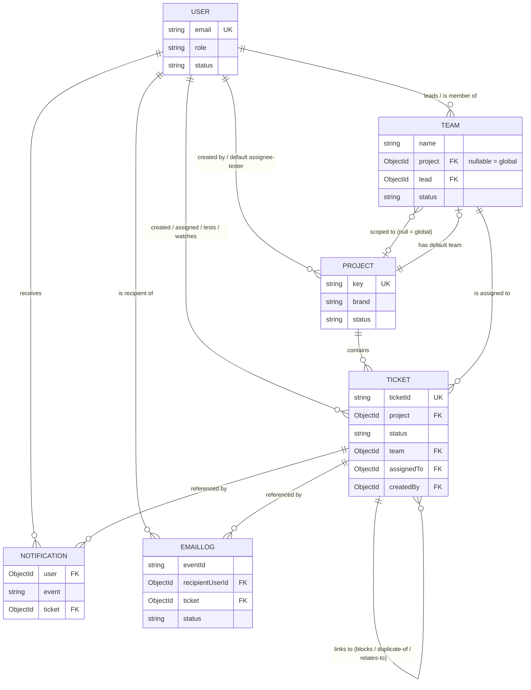

# Data Model

MongoDB via Mongoose. Six collections exist: `User`, `Team`, `Project`, `Ticket`,
`Notification`, `EmailLog`. There is no separate `Organization`, `Client`, `Environment`,
`Role`, `Permission`, or `Product/Module` collection — see [Planned Entities](#planned-entities-not-yet-implemented).

## Conventions applied to every model

All six schemas run `backend/src/platform/toJSON.plugin.js` via `schema.plugin(toJSON)`.
On serialization (`res.json(doc)` etc.) this, for every model, uniformly:

- renames `_id` → `id` (string)
- deletes `__v`
- deletes any path declared `{ private: true }` in its schema, at any depth

Fields marked **private** below are stripped from every API response; they still exist in
the database.

All six schemas use `{ timestamps: true }` (or a partial form — noted per model), giving
`createdAt`/`updatedAt`. No model implements soft delete — every collection uses an
`enum` `status` field (`active`/`archived`/`invited`/`inactive`) instead of a `deletedAt`
flag; deletion is exclusion by status, not schema-level.

---

## User

`backend/src/modules/users/user.model.js`

Purpose: account + authentication/session state + per-user notification preferences. There
is no separate `Account`, `Session`, or `Profile` collection — all embedded here.

| Field | Type | Required | Notes |
|---|---|---|---|
| `name` | String | conditionally | required only while `status === 'active'` (custom validator) |
| `email` | String | yes, **unique** | lowercased + trimmed via a setter, so case/whitespace can't create duplicate identities |
| `password` | String | yes | bcrypt hash (10 rounds), min length 8, **private**, `select: false` |
| `role` | String enum | no | `ROLES = ['admin','lead','qa','developer','member']`, default `'member'`, indexed. This is the entire authorization model — see [RBAC.md](./RBAC.md) |
| `kind` | String enum | no | `['internal','reporter']`, default `'internal'` — reserved, unused in current build |
| `status` | String enum | no | `['invited','active','inactive']`, default `'invited'`, indexed |
| `inviteTokenHash` | String | no | sha256 of invite/reset token, **private**, `select: false` |
| `inviteTokenExpiresAt` | Date | no | `select: false` |
| `lastLoginAt` | Date | no | |
| `refreshTokens` | [RefreshToken subdoc] | no | **private**, `select: false`; capped at 10 (oldest dropped on save) |
| `consumedRefreshTokens` | [ConsumedToken subdoc] | no | **private**, `select: false`; capped at 50 — retained (not deleted) so a replayed/stolen token is attributable to a user |
| `notificationPrefs.email` | Map<String,Boolean> | no | defaults from `@pms/shared` `DEFAULT_NOTIFICATION_PREFS.email` |
| `notificationPrefs.inApp` | Map<String,Boolean> | no | defaults from `DEFAULT_NOTIFICATION_PREFS.inApp` |

**RefreshToken** subdocument (`_id: false`): `tokenHash` (sha256, required), `expiresAt`
(required), `createdAt`, `userAgent`, `ip`.

**ConsumedToken** subdocument (`_id: false`): `tokenHash` (required), `consumedAt`.

Indexes: `role`, `status` (single-field, via `index: true`); `email` unique index.

Instance/static helpers: `isPasswordMatch()`, `findByNormalisedEmail()`, `isEmailTaken()`.
Password is hashed in a `pre('save')` hook only `if (this.isModified('password'))`.

Relationships: referenced by `Team.lead`, `Team.members[]`, `Team.createdBy`,
`Project.defaultAssignee`, `Project.defaultTester`, `Project.createdBy`, `Ticket.assignedTo`,
`Ticket.testedBy`, `Ticket.watchers[]`, `Ticket.createdBy`, `Ticket.blockedBy`,
`Ticket.resolvedBy`, `Ticket.closedBy`, every `by`/`performedBy`/`uploadedBy`/`commentedBy`
inside Ticket subdocuments, `Notification.user`, `EmailLog.recipientUserId`.

---

## Team

`backend/src/modules/teams/team.model.js`

Purpose: a group of users, optionally scoped to one project.

| Field | Type | Required | Notes |
|---|---|---|---|
| `name` | String | yes | trimmed |
| `project` | ObjectId → `Project` | no | indexed; `null` means **global** — usable on every project. This null-check is the entire global/project-scoped-team rule (see `isTeamUsableOnProject()`) |
| `lead` | ObjectId → `User` | no | |
| `members` | [ObjectId → `User`] | no | default `[]` |
| `status` | String enum | no | `['active','archived']`, default `'active'`, indexed |
| `createdBy` | ObjectId → `User` | yes | |

Indexes: compound `{ project: 1, status: 1 }`; single-field `project`, `status`.

Relationships: `Project.defaultTeam` → Team; `Ticket.team` → Team.

---

## Project

`backend/src/modules/projects/project.model.js`

Purpose: top-level container tickets belong to; owns a ticket-id sequence and a
module/page taxonomy used to classify tickets.

| Field | Type | Required | Notes |
|---|---|---|---|
| `key` | String | yes, **unique**, **immutable** | uppercased via setter; `match: /^[A-Z][A-Z0-9]{1,9}$/`; immutable because it's embedded in every already-issued ticket id. `'DEV'` is reserved (`RESERVED_PROJECT_KEYS`) for legacy ticket-id compatibility |
| `brand` | String | yes | indexed, default `'Uncategorized'` — the closest existing field to a "client" grouping (see [Planned Entities](#planned-entities-not-yet-implemented)) |
| `name` | String | yes | trimmed |
| `description` | String | no | |
| `status` | String enum | no | `['active','archived']`, default `'active'`, indexed |
| `nextTicketSeq` | Number | no | default 1, min 1 — only ever mutated via `Project.allocateTicketSeq()`, an atomic `findOneAndUpdate` `$inc` so concurrent ticket creation can't collide |
| `modules` | [Module subdoc] | no | default `[]` — this project's own module/page taxonomy, distinct from any RBAC "product/module" concept |
| `defaultAssignee` | ObjectId → `User` | no | |
| `defaultTester` | ObjectId → `User` | no | |
| `defaultTeam` | ObjectId → `Team` | no | |
| `createdBy` | ObjectId → `User` | yes | |

**Module** subdocument (`_id: false`): `label` (required), `pages: [Page]`.
**Page** subdocument (`_id: false`): `label` (required), `path`.

Indexes: `key` unique; `brand`, `status` single-field.

Relationships: `Ticket.project` → Project (required). `Ticket.module`/`Ticket.page` are
free-text strings validated against `project.modules` in the service layer, not by a schema
enum or foreign key.

---

## Ticket

`backend/src/modules/tickets/ticket.model.js`

Purpose: the core work item. Comments, attachments, activity log, and stage history are
embedded directly in the document (not separate collections) — the code comments this as an
intentional "embedding ceiling" against MongoDB's 16MB document limit, with an explicit
upgrade path (move `comments` to its own collection) if that limit is ever approached.

| Field | Type | Required | Notes |
|---|---|---|---|
| `ticketId` | String | yes, **unique** | plain string, not regex-validated against the project key, so imported legacy ids (e.g. `DEV-MSIN0F6Q-0BFD8854`) can be stored verbatim |
| `project` | ObjectId → `Project` | yes | indexed |
| `title` | String | yes | trimmed |
| `description` | String | no | |
| `stepsToReproduce` | String | no | |
| `module` | String | no | validated against `project.modules` in the service layer |
| `page` | String | no | |
| `environment` | String enum | no | `ENVIRONMENTS = ['Staging','Production']`, default `'Staging'` |
| `category` | String enum | no | `CATEGORIES = ['Bug','New Feature','Improvement']` |
| `labels` | [String enum] | no | `LABELS = ['regression','needs-repro','good-first-bug','performance','security','ui']` |
| `severity` | String enum | no | `SEVERITIES = ['Minor','Major','Critical','Blocker']` |
| `priority` | String enum | no | `PRIORITIES = ['Low','Medium','High','Urgent']` |
| `status` | String enum | no | `STAGE_KEYS` (workflow stage — see `@pms/shared/stages.js`), default `'pending'`, indexed |
| `team` | ObjectId → `Team` | no | indexed |
| `assignedTo` | ObjectId → `User` | no | indexed |
| `testedBy` | ObjectId → `User` | no | |
| `watchers` | [ObjectId → `User`] | no | default `[]` |
| `createdBy` | ObjectId → `User` | yes | |
| `revision` | Number | no | default 0 — optimistic-concurrency counter; every mutation must carry it |
| `estimatedResolutionAt` | Date | no | drives "overdue" ticket calculations (see `team.service.js`) |
| `expectedReleaseDate` | Date | no | |
| `blocked` | Boolean | no | default false — orthogonal to `status`; a ticket can be `in_progress` *and* blocked |
| `blockerReason` | String | no | |
| `blockedAt` | Date | no | |
| `blockedBy` | ObjectId → `User` | no | |
| `stageHistory` | [StageHistory subdoc] | no | default `[]` |
| `activityLog` | [ActivityLog subdoc] | no | default `[]` |
| `comments` | [Comment subdoc] | no | default `[]` |
| `attachments` | [Attachment subdoc] | no | default `[]` |
| `links` | [Link subdoc] | no | default `[]` |
| `reopenCount` | Number | no | default 0 |
| `reopenedAt` | Date | no | |
| `resolvedAt` / `resolvedBy` | Date / ObjectId → `User` | no | **migration-compatibility only** — new pipeline never writes these; analytics reads `stageHistory` instead; only imported legacy tickets populate them |
| `closedAt` / `closedBy` / `closeReason` | Date / ObjectId → `User` / String | no | |

**StageHistory** subdocument (has `_id`): `from` (STAGE_KEYS), `to` (STAGE_KEYS, required),
`by` (User, required), `at` (default now), `decision` (`'approved'|'rejected'|null`, only set
on QA hops), `note`.

**ActivityLog** subdocument (has `_id`): `action` (required), `performedBy` (User, required),
`at` (default now), `changes: [{ field, from: Mixed, to: Mixed }]`.

**Comment** subdocument (own `createdAt` timestamp only, no `updatedAt`): `content`
(required), `commentedBy` (User, required), `mentions: [User]`, `reactions: [Reaction]`,
`attachments: [Attachment]`, `clientRef` (client-generated UUID — makes a retried comment
submission a no-op), `editedAt`.

**Reaction** subdocument (`_id: false`): `emoji` (required), `users: [User]`.

**Attachment** subdocument (has `_id`, reused for both ticket-level and comment-level
attachments): `key` (required — object-storage key only, never a URL, since a stored URL
expires), `name` (required), `size`, `mimeType`, `uploadedBy` (User, required), `uploadedAt`,
`clientRef`.

**Link** subdocument (`_id: false`): `rel` (`LINK_RELS = ['blocks','blocked-by','duplicate-of','relates-to']`, required), `ticket` (→ `Ticket`, required).

Indexes: `ticketId` unique; compound `{ project: 1, status: 1 }`,
`{ project: 1, createdAt: -1 }`, `{ status: 1, priority: 1 }`, `{ assignedTo: 1, status: 1 }`,
`{ team: 1, status: 1 }`; single-field `createdBy`, `createdAt`, `module`, plus `project` and
`status` and `assignedTo` and `team` (also covered above via compounds); text index on
`{ title, description }` for search.

> A prior session noted a duplicate index on `createdBy` was found and fixed in this file —
> confirm no redundant index remains if re-auditing.

Relationships: `Ticket.project` → Project, `Ticket.team` → Team, every `User` reference
listed above, `Ticket.links[].ticket` → another Ticket (self-referential), `Notification.ticket`
→ Ticket, `EmailLog.ticket` → Ticket.

---

## Notification

`backend/src/modules/notifications/notification.model.js`

Purpose: in-app notification feed entry for a user.

| Field | Type | Required | Notes |
|---|---|---|---|
| `user` | ObjectId → `User` | yes | indexed |
| `event` | String enum | yes | `NOTIFICATION_EVENTS` from `@pms/shared` — one generic type keyed by event, so `user.notificationPrefs` can gate per-event |
| `ticket` | ObjectId → `Ticket` | no | indexed |
| `title` | String | yes | |
| `body` | String | no | |
| `link` | String | no | |
| `readAt` | Date | no | default `null` |

Indexes: compound `{ user: 1, readAt: 1, createdAt: -1 }` (feed query — unread-first, newest-first).

---

## EmailLog

`backend/src/modules/notifications/emailLog.model.js`

Purpose: delivery record for one outbound email to one recipient — one row per recipient per
event, so a partial send failure is auditable per-person.

| Field | Type | Required | Notes |
|---|---|---|---|
| `eventId` | String | yes | indexed — groups every row from a single domain-event fan-out |
| `event` | String enum | yes | `NOTIFICATION_EVENTS` |
| `ticket` | ObjectId → `Ticket` | no | indexed |
| `recipientUserId` | ObjectId → `User` | yes | |
| `to` | [String] | no | default `[]` |
| `cc` | [String] | no | default `[]` |
| `from` | String | no | sending identity — no mailbox registry exists, this field is how sends are distinguished |
| `subject` | String | no | |
| `template` | String | no | |
| `status` | String enum | no | `['pending','sent','failed']`, default `'pending'`, indexed |
| `attemptCount` | Number | no | default 0 |
| `lastAttemptAt` | Date | no | |
| `messageId` | String | no | deterministic `<eventId>.<recipientUserId>@<domain>` — stable across retries |
| `error` | String | no | |
| `sentAt` | Date | no | |
| `requestId` | String | no | correlates to the HTTP request that triggered the send, via `platform/requestId.js` |

Indexes: compound `{ status: 1, lastAttemptAt: 1 }` (retry-queue query); single-field `eventId`,
`ticket`, `status`.

---

## Entity-Relationship Diagram

Ticket's embedded subdocuments (StageHistory, ActivityLog, Comment, Attachment, Link,
Reaction) are omitted from the diagram above — they are not separate collections, see the
Ticket section for their shape.

---

## Planned Entities (not yet implemented)

The documentation plan (`Agent Context/documentation-plan.md`) describes a target model of
`Organization → Client → Project → Team → Member → Task/Ticket → Workflow → Environment`,
with `Role`, `Permission`, and `Product/Module` as first-class, independently assignable
entities. None of the following exist as Mongoose models or collections today:

- **STATUS: PLANNED — `Organization`**: no multi-tenancy boundary exists. There is one
  implicit tenant per deployment.
- **STATUS: PLANNED — `Client`**: no such collection. `Project.brand` (a free-text string,
  default `'Uncategorized'`) is the closest existing concept, but it is a label on Project,
  not a separate entity with its own fields/relationships.
- **STATUS: PLANNED — `Environment` (as a scoping entity)**: `Ticket.environment` exists but
  is only a two-value enum (`Staging`/`Production`) describing where a bug occurred — it is
  not an access-control scope a user/role can be granted or denied.
- **STATUS: PLANNED — `Product`/`Module` (as an access-control entity)**: `Project.modules`
  exists but is a project-owned taxonomy for classifying tickets (label + pages), not a
  grantable access boundary.
- **STATUS: PLANNED — `Role` / `Permission` (as collections)**: `User.role` is a single enum
  field (`ROLES` in `shared/enums.js`: `admin`, `lead`, `qa`, `developer`, `member`) — there
  is no separate Role or Permission document, no per-project or per-environment role
  assignment, and no explicit-grant model. See [RBAC.md](./RBAC.md) for what the current
  single-field model actually enforces.
- **STATUS: PLANNED — `AuditLog` (system-wide)**: `Ticket.activityLog` exists but is scoped
  to a single ticket's field changes; there is no cross-entity administrative audit trail
  (e.g. role changes, team membership changes, project creation) as its own collection.
- **STATUS: PLANNED — `Task`** as an entity distinct from `Ticket`: the codebase has one
  work-item type (`Ticket`); there is no separate `Task` model.
